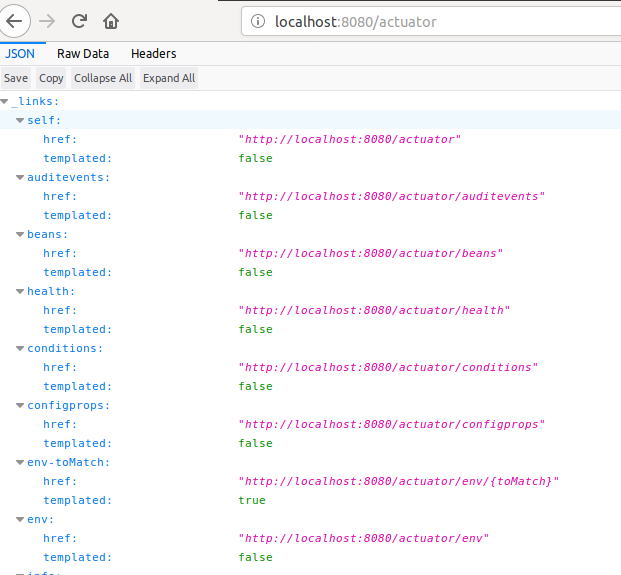
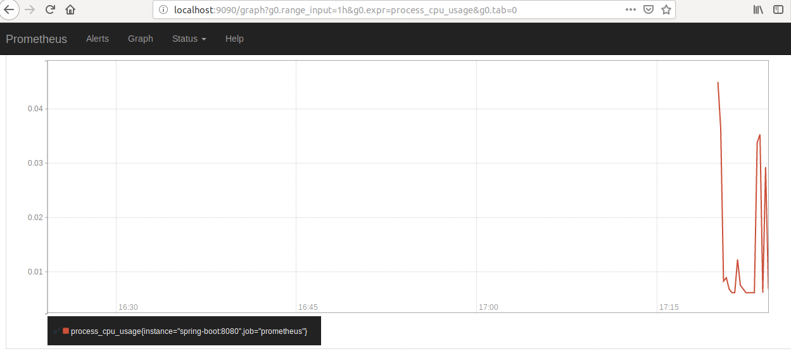
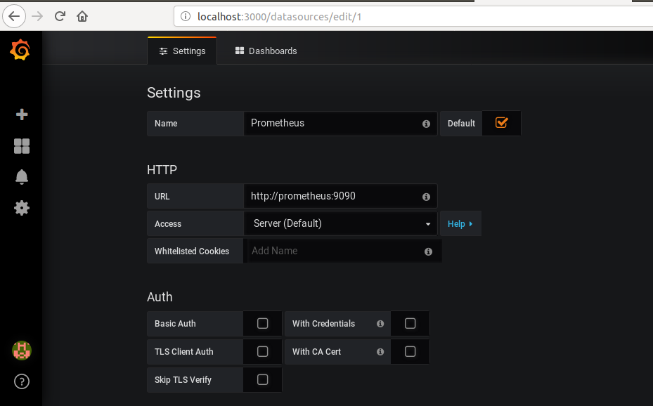
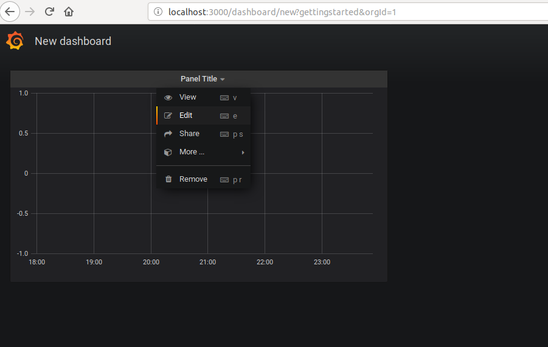
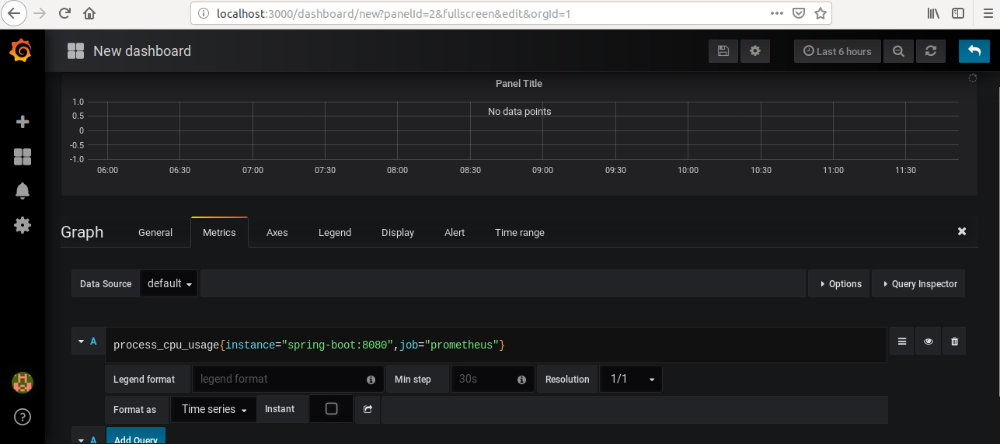
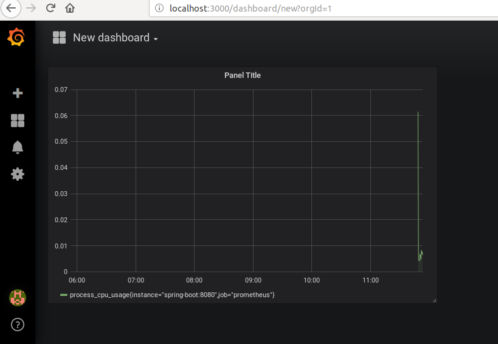

# Description

Java Application Health Check with SpringBoot Actuator, Prometheus, Grafana, circleCi and Docker Compose.

# Tools

<li>Java 1.8.0_171</li>
<li>Maven 3.5.2</li>
<li>Promethes</li>
<li>Grafana</li>
<li>Docker CE 18+</li>
<li>Docker Compose</li>

# Commands

The commands must be run from a terminal.

Clone the repository to create a local copy on your computer

- git clone https://github.com/JonatasRodrigues/Actuator-Prometheus-Grafana.git

Run on root project

- mvn clean install

After build success, start the application and infrastructure via Docker Compose. Make sure your local Docker is running:

- docker-compose up --build

Now, you can navigate.

# Endpoints

<li>Exploring Spring Boot Actuator’s Endpoint.</li>

 -http://localhost:8080/actuator 
 
 
 
 <li>Visualizing Spring Boot Metrics from Prometheus dashboard.</li>

 -http://localhost:9090 
 
 
 
`<li>Configuring Grafana to import metrics data from Prometheus.</li>

Follow the steps below to import metrics from Prometheus and visualize them on Grafana:`

 -http://localhost:3000
 
 1-Add the Prometheus data source in Grafana
 
 
 2-Create a new Dashboard with a Graph
  
 
 3-Add a Prometheus Query expression in Grafana’s query editor
  
 
 4-Visualize metrics from Grafana’s dashboard
  
 
